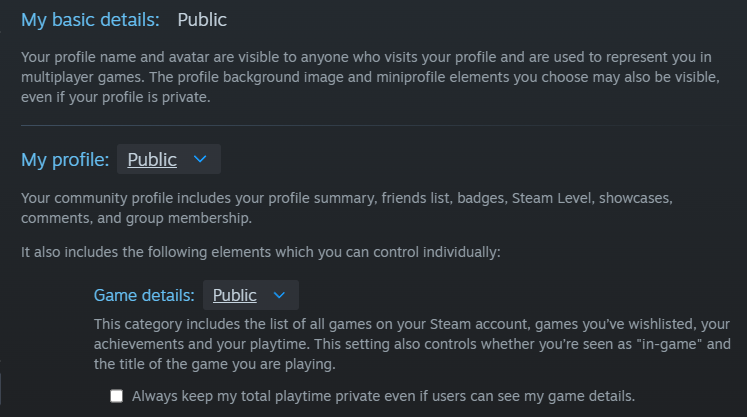
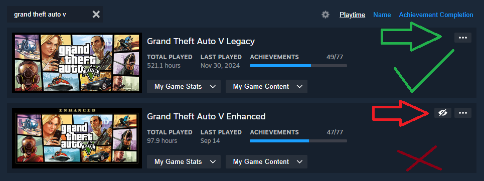
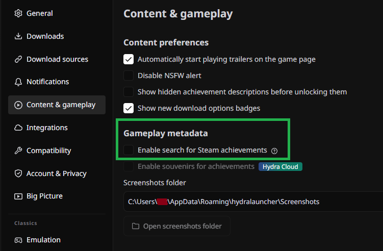
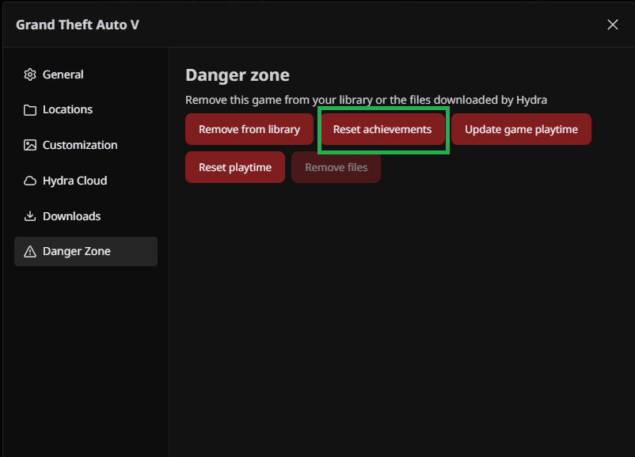
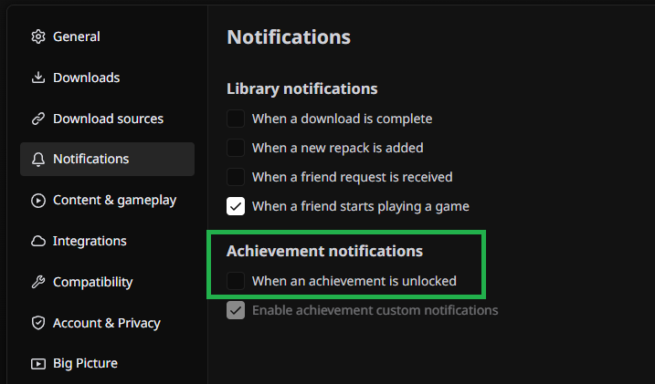
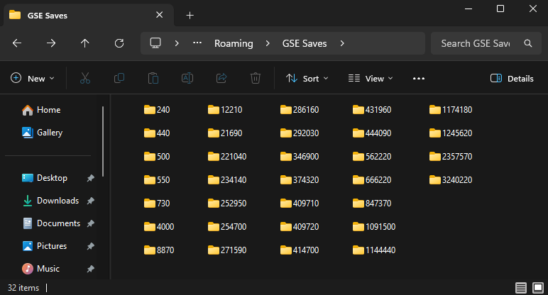
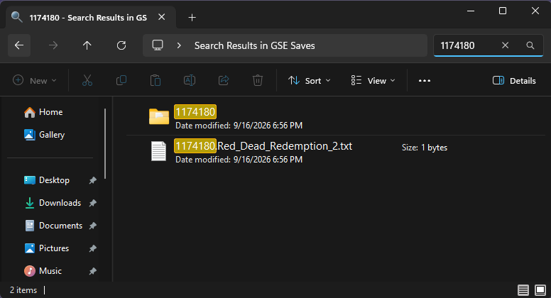

# Hydra Achievements Transfer - Guide

This guide walks you through setting up and using **Hydra Achievements Transfer**, from required steps to optional extras.

**Legend:**
- ✅ **Required** — steps you must follow for the program to work
- ⚠️ **Recommended** — steps that aren't mandatory but will save you trouble
- ℹ️ **Extra** — optional tips, advanced usage, and nice-to-knows
  
---

## ✅ [STEAM] - Make your profile fully public

For the program to fetch your games and achievements, your profile must be set to public. Keep in mind that after making your profile public, it may take a few minutes for Steam to update and for your data to become accessible.

## ✅ [STEAM] - Make sure the game itself isn't set to private

Even with a public profile, individual games can still be marked as private. If your game is set to private, the program won't be able to fetch its achievements and will fail.

---
## ⚠️ [HYDRA] - Disable the Steam achievement search - TEMPORARY

Disable the **"Enable search for Steam Achievements"** option. This is an extremely useful feature, but while using Hydra Achievements Transfer it can cause conflicts, since it's able to fetch and unlock up to 15 of your Steam achievements on its own, though not all of them.

This might potentially conflict with the transfer process, so it's best to disable it while using the program. Just don't forget to turn it back on afterwards. Disabling it isn't mandatory, you can still use the program with the option enabled, but I personally prefer to disable it.

## ⚠️ [HYDRA] - Reset your achievements

Another optional step, but why reset? To avoid possible conflicts. The main reason is this: let's say you already platinumed a game on Steam and want to transfer those achievements to Hydra, but you've also already unlocked some achievements in Hydra itself. The timestamps will end up different. If you run the program without resetting, the achievements you transfer will keep the exact time they were unlocked on Steam, but the ones you already unlocked in Hydra will keep their own separate timestamps. So reset first if you want every achievement to show the exact same day and time as it did on Steam.

## ⚠️ [HYDRA] - Disable achievement notifications - TEMPORARY

Another extremely useful feature, but it gets really annoying to see hundreds of achievement pop-ups flooding your screen. I recommend disabling it while using the program.

---
## ℹ️ [ACHIEVEMENTS TRANSFER] - OPTION: Create a game file in each folder

This option has no impact on functionality, but it's not useless either. Let's say you've unlocked achievements for hundreds of games, your GSE Saves folder will end up populated with hundreds of AppIDs. If you ever want to modify something, you'd have to go online and look up which game each AppID belongs to. With this option enabled, you just need to open the game's folder and you'll immediately see the game name, for example: `8870.BioShock_Infinite.txt`.

