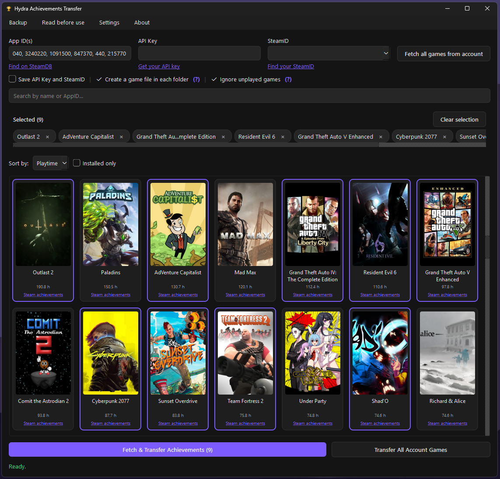

# Hydra Achievements Transfer - Hydra-AT

> Desktop tool to edit and transfer Steam achievements for games using **GSE Saves** (Goldberg Steam Emulator), pulling real account data via the **Steam Web API**.

[](https://www.python.org/)
[](https://doc.qt.io/qtforpython/)
[](#license)

## Overview

**Hydra Achievements Transfer** is a Python (PySide6/Qt) desktop application that reads your real achievement data from Steam via the **Steam Web API**, converts it into the **GSE Saves** `achievements.json` format, and writes it directly into the game's GSE Saves folder, so achievements can be properly unlocked and recognized by **Hydra Launcher**.

It does **not** bundle or use Goldberg Steam Emulator itself, it only performs the data conversion, acting as a bridge between your real Steam achievement data and the GSE Saves format Hydra Launcher understands.

- 🌑 Clean, dark-themed UI (English)
- 🔗 Fetches real achievement data directly from the Steam Web API
- 🔄 Converts data into a GSE Saves–compatible `achievements.json`
- ⏱️ Preserves original unlock timestamps and dates/times
- 📁 Writes the converted file straight into the game's GSE Saves folder
- 💾 Built-in backup system before overwriting existing data
- ⚡ Lightweight, no unnecessary bloat


[Guide](GUIDE.md)

## Requirements

- Python 3.9+
- Dependencies listed in `requirements.txt`:

```
PySide6>=6.5
requests>=2.28
```

## Installation & Usage

```powershell
# 1. Install dependencies
pip install -r requirements.txt

# 2. Run the application
python main.py
# or
py main.py
```

## FAQ

**Can I get banned?**
No. The program does not modify any Steam files or game files. The entire process only extracts public data through the Steam Web API.

**Can I use an API key from a secondary account?**
Yes, but the SteamID field must be filled in with your real/main account. The API key itself can be any valid key.

## AI Disclaimer

This software was built with the help of AI. I chose this approach to save time, since I'm quite rusty when it comes to programming, this was my first experience creating something with AI, and my total budget was just $2. So don't expect a top-tier project. That said, I used some of my own programming knowledge to try to make something reasonably well-structured, rather than just a generic prompt output. Despite all of this, it's a functional program that does what I set out to build.

## License

Licensed under the [GNU General Public License v3.0](LICENSE).
